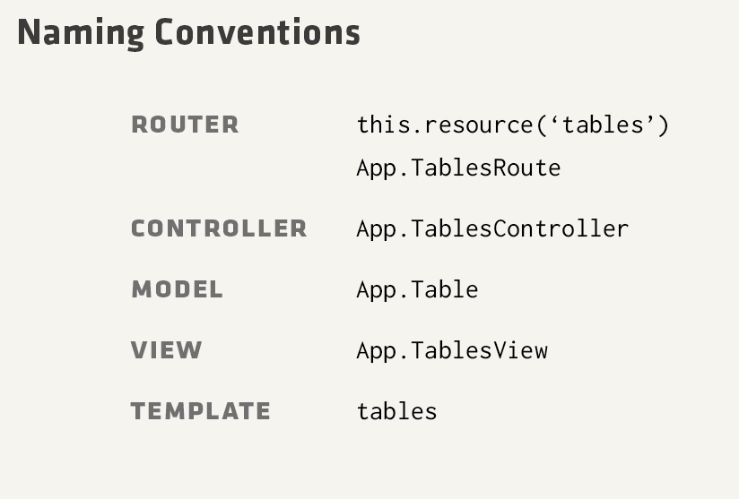
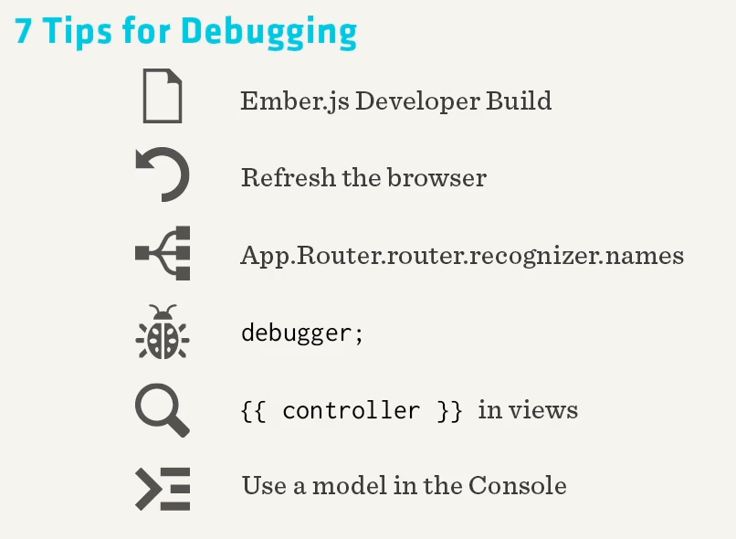

## Notes

- router loads the data instead of the controller
- why is data setup on the router??
- render vs partial. Partial uses same controller. Render uses different controller and context.
- debugging in console
  - `App.Router.router.recognizer.names`
  - `App.Table.find(1).get('id')`
  - `App.Table.find().objectAt(3).get('tab').get('tabItems').objectAt(2).get('cents')`
- 
- 

## Controllers

- controllers are the proxy access to the data model
- controllers
  - on `Ember.Controller`, views just call the controller
  - `Ember.ObjectController`, views call controller.model
  - `Ember.ArrayController`, controller is an array, so you can do `{{#each controller}}`

## Views

- `{{ outlet }}` == yield in Ruby